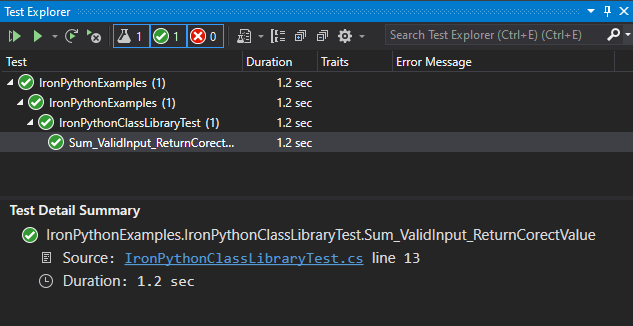

# How to run the project locally
- This works on Windows only and I can't get compiled Python DLL to target .NET 5
  due to [the reason in this GitHub issue](https://github.com/IronLanguages/ironpython3/issues/1291)


## Prerequisite
- Installed Visual Studio 2019
- Installed [.NET Framwork 4.8](https://go.microsoft.com/fwlink/?linkid=2088517)
- Installed [IronPython for Windows](https://github.com/IronLanguages/ironpython3/releases/download/v3.4.0-alpha1/IronPython-3.4.0a1.msi)
- A sytem path variable contains `C:\Program Files\IronPython 3.4` folder.

## Prepare source code and environment
- Clone the project.
```
git clone git@github.com:dotnetthailand/iron-python-examples.git
```
- CD to `iron-python-examples` folder.
```
cd iron-python-examples
```
- Double click `IronPythonExamples.sln` to open the project with Visual Studio.
- The current project file/folder structure.
  ```
  iron-python-examples/
  ├── IronPythonClassLibraryTest.cs (the main test class)
  ├── IronPythonExamples.csproj
  ├── IronPythonExamples.sln
  ├── Math.py (Python code which will be compiled to Math.dll by ipyc.exe)
  ```

## Build the project and run unit test
- In the Solution Explorer window, select project `IronPythonExamples` node.
- Press `Ctrl+Shift+B` to build the project.
- Open `IronPythonClassLibraryTest.cs`, and click somewhere inside `Sum_ValidInput_ReturnCorectValue` test case.
- Press `Ctrl+R, T` to run the test case.
- The Test Explorer window will be automaticall opened and it will show a status of the running test case.
- You should find a successful test result as the screenshot below.



# Useful tools for COM
- OleViewDotNet, search by ProgId "ThaiTranslite"
- C:\Program Files (x86)\Windows Kits\10\bin\10.0.19041.0\x86\oleview.exe after you have installed "development with C++" from Visual Studio Installer.
- RegDllView
- RegistryFinder

# Useful resource
- https://www.py4u.net/discuss/736777
- https://www.codemag.com/Article/2009101/Interactive-Unit-Testing-with-.NET-Core-and-VS-Code
- [How to Register and Unregister a DLL or ActiveX Controls Using Regsvr32.exe](https://www.c-sharpcorner.com/UploadFile/8911c4/how-to-register-and-unregister-a-dll-or-activex-controls-usi/)
- [How C# new dynamic type can simplify access to late bound COM object](https://www.c-sharpcorner.com/uploadfile/3b799a/how-C-Sharp-new-dynamic-type-can-simplify-access-to-late-bound-com-object/)
- https://adamtheautomator.com/regsvr32-exe/
- [C# interop with C/C++ and Rust in WebAssembly](https://platform.uno/blog/c-interop-with-c-c-and-rust-in-webassembly/)

